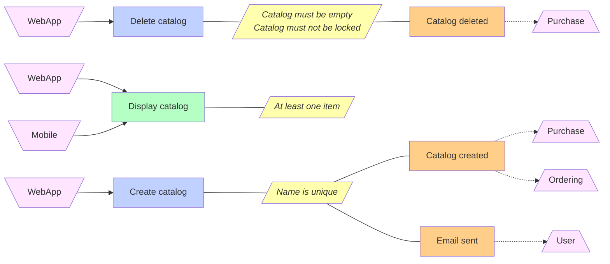

# Bounded context canvas generator 🔣 -> 📝

This repository is a proof of concept to generate a Bounded Context Canvas directly from source code.

## Description

The idea is to analyse **symbols and annotations** from a target solution in order to detects DDD tactical patterns,
(commands, aggregate, entity, value object, domain event, integration event, ... ) and draw diagrams
and text description.

## Command line generation

Current :

    ./BoundedContextCanvasGenerator.exe path/to/sln

By default:
- the generator is looking for the yaml configuration in the same solution folder, named **bounded_context_canvas_settings.md**
- the generator is outputting the final markdown in the same solution folder, named **bounded_context_canvas.md**

Optional parameters:

    --output $filePath : The output markdown file.
    --configuration $filePath: The yaml configuration file.

Later :
    
    dotnet tool install --global BoundedContextCanvasGenerator
    dotnet tool run BoundedContextCanvasGenerator /path/to/sln

## Configuration

The configuration is a **yaml format** that describes bounded context canvas information and
how to retrieve core concepts.

```yaml
name: Catalog
definition:
    description: Display the product catalog and the items available to purchase. Allows extended search to find a specific item. Provide the ability for administrators to update catalogs and associated items.
    strategic_classification:
        domain: core
        business_model: revenue_generator
        evolution: commodity
    domain_role:
        name: gateway context
        description: Provide catalog item allowing Basket, Ordering and Payment contexts to properly work.
ubiquitous_language:
    selector: concrete class implementing '.*IAggregateRoot<.*>'
inbound_communication:
    selector: class implementing '.*ICommand$'
```

[Full example here](src/SolutionExample/Example/bounded_context_canvas_settings.yaml)

## Generated markdown

Based on the configuration, and the source code in [SolutionExample](src/SolutionExample/Example/), the generated markdown looks this.


[Full generated markdown here](src/SolutionExample/Example/bounded_context_canvas.md)

## Objectives

Main objectives are :

- Generating the maximum of information without modifying any code (ie attributes)
- Support multiple architecture (hexa, CQS, CRUD) or file structure
- Support high extensibility (configuration to retrive core concepts)
- Generate domain graph with high business value, ie :



## More in depth

This repository is a *proof of concept* to generate a **Bounded Context Canvas** directly from source code.

The living documentation follows the idea that **the source code is the only source of truth that is always up to date**.
Creating documentation from it ensures the documentation is always up to date.

Also from a DDD perspective, if it is hard to generate from your code a **readable and comprehensible documentation** for teams 
and domain experts, it probably means the code is **diverging** from the domain you are addressing. Wrong domain language, 
technical details or poor object design might be the cause.

## Definition

### DDD
Domain-driven design is a software design approach focusing **on modelling software 
to match a domain** according to input from that domain's experts. In terms of object-oriented programming 
it means that the structure and language of software code **should match the business domain**.

### Bounded context
In Domain Driven Design (DDD), a bounded context is a sub-system in a software architecture 
aligned to a part of your domain.

More links:
- https://martinfowler.com/bliki/BoundedContext.html

### Canvas
A Bounded Context Canvas is a collaborative tool for designing and documenting 
the design of a single bounded context. It might also represent context interactions in order to
detail teams interaction.

Links:
- https://github.com/ddd-crew/bounded-context-canvas


