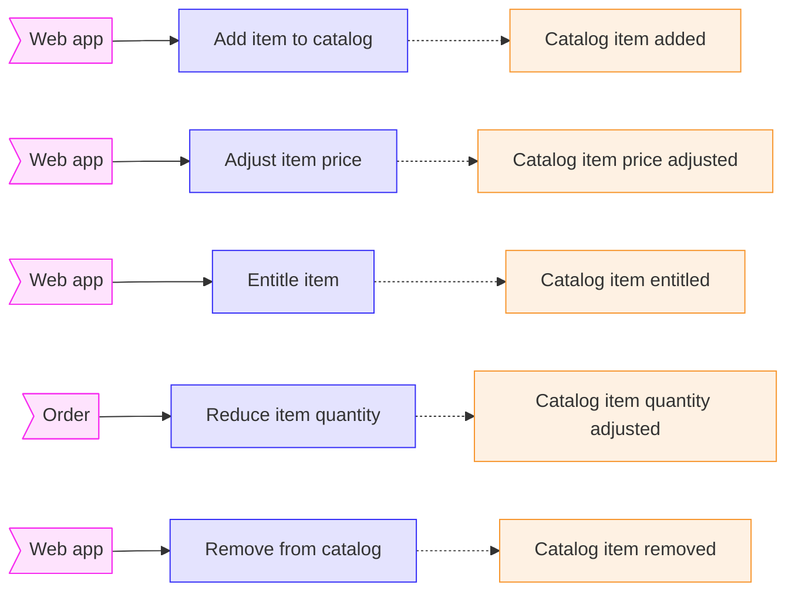

# Catalog

## Definition

### Description

> Display the product catalog and the items available to purchase. Allows extended search to find a specific item. Provide the ability for administrators to update catalogs and associated items.

### Strategic classification [(?)](https://github.com/ddd-crew/bounded-context-canvas#strategic-classification)

| Domain                                         | Business Model                                         | Evolution                                             |
| ---------------------------------------------- | ------------------------------------------------------ | ----------------------------------------------------- |
| *Core domain* (a key strategic initiative) | *Revenue generator* (people pay directly for this) | *Commodity* (highly\-standardised versions exist) |

### Domain role [(?)](https://github.com/ddd-crew/bounded-context-canvas/blob/master/resources/model-traits-worksheet.md): *gateway context*

Provide catalog item allowing Basket, Ordering and Payment contexts to properly work.

## Ubiquitous language (Context\-specific domain terminology)

| Catalog                                                                                             | Catalog item                                                                               |
| --------------------------------------------------------------------------------------------------- | ------------------------------------------------------------------------------------------ |
| An enumeration of items to purchase. It is systematically described and target a specific audience. | An item of a catalog. It is the minimum unit to purchase. The price includes the currency. |

## Inbound communication

### Catalog

---

```mermaid
flowchart LR
    classDef commands fill:#352ef722, stroke:#352ef7;
    classDef frontCollaborators fill:#f72ef022, stroke:#f72ef0;
    classDef domainEvents fill:#f7962e22, stroke:#f7962e;
    classDef policies fill:#E9E70522, stroke:#E9E705, font-style:italic;
    classDef integrationEvents fill:#f7962e22, stroke:#f7962e;
    CatalogApplicationCatalogDeleteCatalogCommand["Delete catalog"]
    class CatalogApplicationCatalogDeleteCatalogCommand commands;
    CatalogApplicationCatalogDeleteCatalogCommandWebAppCollaborator>"Web app"]
    class CatalogApplicationCatalogDeleteCatalogCommandWebAppCollaborator frontCollaborators;
    CatalogDomainCatalogEventsCatalogDeleted["Catalog deleted"]
    class CatalogDomainCatalogEventsCatalogDeleted domainEvents;
    CatalogApplicationCatalogRegisterNewCatalogCommand["Register new catalog"]
    class CatalogApplicationCatalogRegisterNewCatalogCommand commands;
    CatalogApplicationCatalogRegisterNewCatalogCommandWebAppCollaborator>"Web app"]
    class CatalogApplicationCatalogRegisterNewCatalogCommandWebAppCollaborator frontCollaborators;
    CatalogApplicationCatalogRegisterNewCatalogCommandPolicies[/"A catalog name is unique<br/>Registering a catalog raises registered event"/]
    class CatalogApplicationCatalogRegisterNewCatalogCommandPolicies policies;
    CatalogDomainCatalogEventsCatalogRegistered["Catalog registered"]
    class CatalogDomainCatalogEventsCatalogRegistered domainEvents;
    CatalogInfrastructureCatalogCatalogCreatedIntegrationEvent["Catalog created integration event"]
    class CatalogInfrastructureCatalogCatalogCreatedIntegrationEvent integrationEvents;
    CatalogApplicationCatalogDeleteCatalogCommandWebAppCollaborator --> CatalogApplicationCatalogDeleteCatalogCommand
    CatalogApplicationCatalogDeleteCatalogCommand -.-> CatalogDomainCatalogEventsCatalogDeleted
    CatalogApplicationCatalogRegisterNewCatalogCommandWebAppCollaborator --> CatalogApplicationCatalogRegisterNewCatalogCommand
    CatalogApplicationCatalogRegisterNewCatalogCommand --- CatalogApplicationCatalogRegisterNewCatalogCommandPolicies
    CatalogApplicationCatalogRegisterNewCatalogCommandPolicies -.-> CatalogDomainCatalogEventsCatalogRegistered
    CatalogDomainCatalogEventsCatalogRegistered -.-> CatalogInfrastructureCatalogCatalogCreatedIntegrationEvent
```

### Items

---

